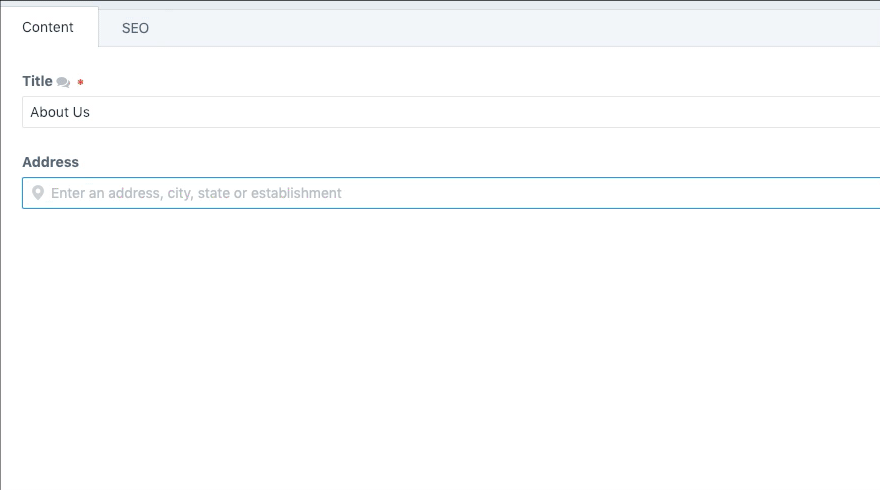

# 🗺 Places

Geocode your content using Google's Place Autocomplete field

## Requirements

This plugin requires Craft CMS 3.0.0-beta.23 or later.

## Installation

To install the plugin, follow these instructions.

1. Open your terminal and go to your Craft project:

        cd /path/to/project

2. Then tell Composer to load the plugin:

        composer require trendyminds/places

3. In the Control Panel, go to Settings → Plugins and click the “Install” button for Places.

## Attribution
[Pin marker by Iconnic from the Noun Project](https://thenounproject.com/search/?q=pin&i=2207989)
