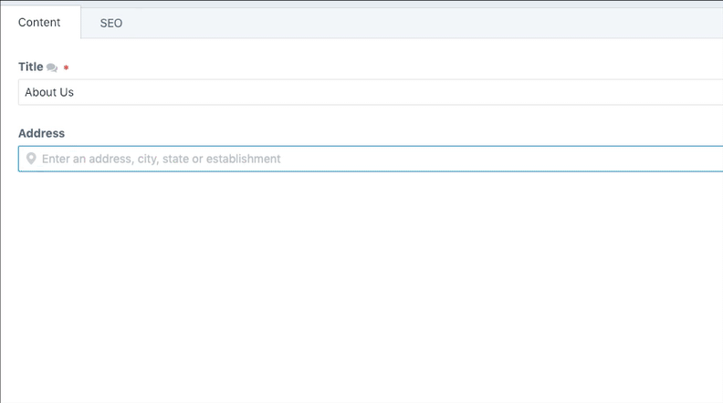

#  Places

Geocode your content using Google's Place Autocomplete field



## Why Places?

Places solely exists to geotag your content so you may use the latitude/longitude, street, city, state, zip, etc in whatever way you choose. It's a BYOMS (bring your own mapping system) setup so that you can use the data however you'd like.

If you are looking for a more feature-complete tool that handles mapping (and much more) I'd highly recommend [Double Secret Agency's Smart Map plugin](http://plugins.craftcms.com/smart-map)

## Template Usage
Once you have data entered into your Places field type you can query it using the following syntax:

```twig
{{entry.yourField.place}}
{{entry.yourField.city}}
{{entry.yourField.state}}
{{entry.yourField.zip}}
{{entry.yourField.country}}
{{entry.yourField.lat}}
{{entry.yourField.lng}}
```

## Requirements

This plugin requires Craft CMS 3.0.0-beta.23 or later.

## Installation

To install the plugin, follow these instructions.

1. Open your terminal and go to your Craft project:

        cd /path/to/project

2. Then tell Composer to load the plugin:

        composer require trendyminds/places

3. In the Control Panel, go to Settings → Plugins and click the “Install” button for Places.

## Attribution
[Pin marker by Iconnic from the Noun Project](https://thenounproject.com/search/?q=pin&i=2207989)
